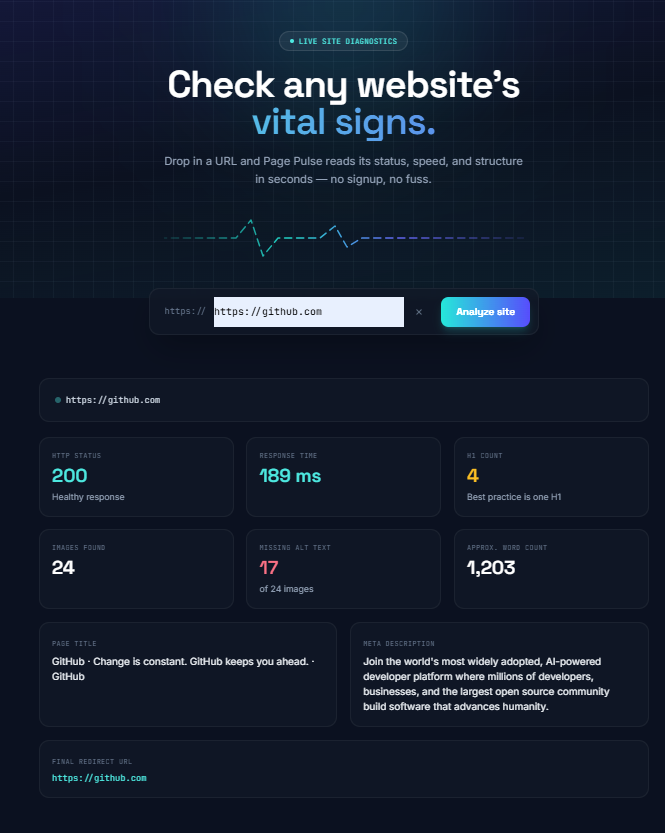

# 🚀 Page Pulse

A production-ready, full-stack **Website Auditing Tool** that analyzes any website and provides detailed insights including HTTP status, response time, page title, meta description, heading structure, image analysis, word count, and redirect information.

Built for the **Digital Heroes Software Development Internship**.

---

## 🌐 Live Demo

**Frontend:** https://page-pulse-iota-three.vercel.app/

**Backend API:** https://page-pulse-production-5aaa.up.railway.app/

---

## 📂 GitHub Repository

https://github.com/009vinaysharma/page-pulse

---

# ✨ Features

- 🌐 Website Health Analysis
- ⚡ HTTP Response Time
- ✅ HTTP Status Code
- 📝 Page Title Detection
- 📄 Meta Description Extraction
- 🔍 H1 Heading Count
- 🖼️ Total Images Count
- ♿ Missing ALT Text Detection
- 📚 Word Count Analysis
- 🔀 Redirect Detection
- 📱 Responsive UI
- 🚀 FastAPI REST API
- 🎨 Modern React + Tailwind Interface

---

# 🛠 Tech Stack

### Frontend
- React (Vite)
- Tailwind CSS
- Axios

### Backend
- FastAPI
- Requests
- BeautifulSoup4
- lxml
- Uvicorn

---

# 🏗 Architecture

```
page-pulse/
├── backend/
│   ├── app/
│   │   ├── main.py
│   │   ├── core/
│   │   ├── domain/
│   │   ├── services/
│   │   └── api/
│   ├── requirements.txt
│   ├── Dockerfile
│   ├── .env.example
│   └── .gitignore
│
└── frontend/
    ├── src/
    ├── public/
    ├── package.json
    ├── vercel.json
    └── .gitignore
```

---

# 📸 Output

> Website Audit Result

<p align="center">

</p>

---

# ⚙ Running Locally

## Backend

```bash
cd backend

python -m venv venv

# Windows
venv\Scripts\activate

pip install -r requirements.txt

uvicorn app.main:app --reload
```

Backend runs at

```
http://localhost:8000
```

Swagger

```
http://localhost:8000/docs
```

---

## Frontend

```bash
cd frontend

npm install

npm run dev
```

Frontend

```
http://localhost:5173
```

---

# 📌 API Endpoint

## Analyze Website

```
POST /api/analyze
```

### Request

```json
{
  "url":"https://github.com"
}
```

### Response

```json
{
  "success": true,
  "http_status": 200,
  "response_time_ms": 189,
  "title": "GitHub",
  "meta_description": "...",
  "h1_count": 4,
  "image_count": 24,
  "images_missing_alt": 17,
  "word_count": 1203
}
```

---

# 🚀 Deployment

## Backend

Hosted on **Railway**

```
https://page-pulse-production-5aaa.up.railway.app
```

### Railway Environment Variables

```
ALLOWED_ORIGINS_RAW=https://page-pulse-iota-three.vercel.app

ENVIRONMENT=production

LOG_LEVEL=INFO
```

---

## Frontend

Hosted on **Vercel**

```
https://page-pulse-iota-three.vercel.app
```

Environment Variable

```
VITE_API_BASE_URL=https://page-pulse-production-5aaa.up.railway.app
```

---

# 🔒 Security

- URL Validation
- SSRF Protection
- CORS Protection
- Response Size Limiting
- Timeout Protection
- Structured Error Handling
- Input Validation using Pydantic

---

# ⚡ Performance

- Fast HTML Parsing using **lxml**
- Lazy Loaded Components
- Memoized React Components
- Request Cancellation
- Optimized API Responses
- Streaming Response Handling

---

# 🎯 Project Highlights

- Full Stack Web Application
- Production Ready Architecture
- REST API using FastAPI
- Responsive UI
- Railway Deployment
- Vercel Deployment
- Dockerized Backend
- Modern React Architecture
- SEO Friendly
- Clean Folder Structure

---

# 👨‍💻 Author

**Vinay Sharma**

B.Tech CSE (Artificial Intelligence)

Arya College of Engineering, Jaipur

GitHub

https://github.com/009vinaysharma

---

## ⭐ If you like this project, don't forget to Star the repository.
